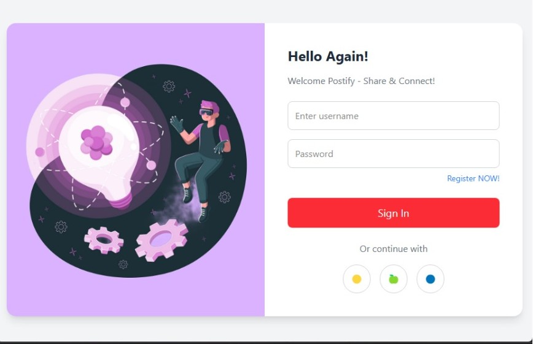
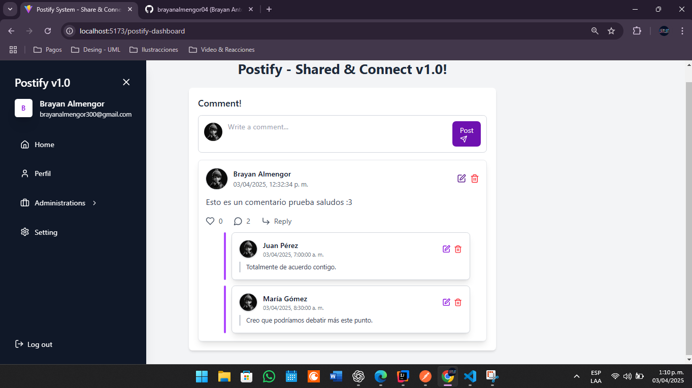
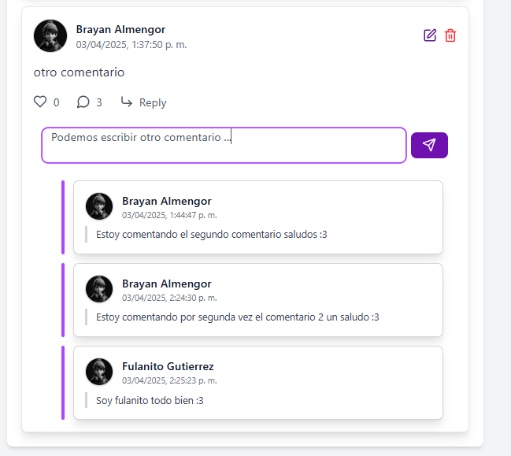

# 🚀 Postify Frontend - Share & Connect

Welcome to **Postify Frontend**, the React-based user interface that powers **Postify - Share & Connect**. This project consumes the backend API of Postify, allowing users to create posts, comment, and engage in interactive features. 💬🎉

---
## 📌 Features
- **📡 API Integration**: Seamlessly fetch and send data to the backend.
- **🎨 Modern UI**: Built with React and TailwindCSS for a sleek design.
- **🛠️ Modular Architecture**: Organized components for scalability.
- **💬 Interactive Comments**: Engage in discussions in real-time.
- **🔒 Authentication**: Secure login and role-based access control.

---
## 📂 Project Structure
```
└── 📁public
    └── vite.svg
└── 📁src
    └── 📁api
        └── 📁role
            └── AdmTableRole.jsx
        └── 📁user
            └── AdmTableUser.jsx
            └── CreateUser.jsx
    └── 📁assets
        └── 📁images
            └── avatarDefault.jpg
            └── login.png
        └── react.svg
    └── 📁auth
    └── 📁components
        └── 📁Comment
            └── CommentItem.jsx
        └── DropdownMenu.jsx
        └── FormDialogRole.jsx
        └── 📁Reply
            └── ReplyItem.jsx
    └── 📁hooks
        └── useComments.jsx
    └── 📁pages
        └── 📁dasboard
            └── DasboardPage.jsx
        └── Login.jsx
    └── 📁routes
    └── 📁template
        └── SiderBarMenu.jsx
    └── App.jsx
    └── index.css
    └── main.jsx
```
---

## ⚙️ Tech Stack
| **Category**  | **Technologies**             |
|--------------|-----------------------------|
| **Frontend** | React, Vite, TailwindCSS    |
| **State Mgmt** | React Hooks               |
| **Backend API** | Spring Boot (Postify API) |

---

## 🚀 Getting Started
### 1️⃣ Clone the repository
```bash
git clone https://github.com/brayanalmengor04/postify-frontend.git
cd postify-frontend
```
### 2️⃣ Install dependencies
```bash
npm install
```
### 3️⃣ Run the project
```bash
npm run dev
```
The application should be running at `http://localhost:5173/`

---

## 🔗 Backend API
To set up the backend for **Postify**, clone and follow the instructions in the backend repository:
👉 [Postify Backend Repository](https://github.com/brayanalmengor04/postify-backend)

---

## 💡 Contributing
We welcome contributions to make **Postify Frontend** more efficient, clean, and maintainable! 🚀

### 🛠️ How You Can Help
We follow a **clean code** approach, prioritizing readability, reusability, and performance. Contributions can include:

- **Reducing redundant code** to improve maintainability.
- **Optimizing API calls** to enhance performance.
- **Improving component reusability** to minimize duplication.
- **Enhancing UI/UX** for a better user experience.
- **Fixing bugs & edge cases** to ensure stability.
- **Adding documentation** to improve project clarity.

### 📝 Contribution Guidelines
1. **Fork** the repository 🍴
2. **Create a feature branch** (`git checkout -b refactor-components`) 🌱
3. **Follow best practices** (DRY, KISS, Component Reusability) 📜
4. **Document your changes** clearly in the code 💡
5. **Commit changes** (`git commit -m 'Refactored comment component for reuse'`) 💾
6. **Push to branch** (`git push origin refactor-components`) 🚀
7. **Submit a Pull Request** with a clear explanation 📩

We encourage meaningful discussions and improvements. Let’s build a scalable and efficient platform together! 🔥

---

## 🖼️ Screenshots
### 🔐 Login Page
  
_Users can log in using their credentials to access the platform._

### 📊 Dashboard

_Overview of user activities, including posts, comments, and interactions._

### 💬 Comments Section

_Users can comment on posts and engage in discussions._

### 🆕 New User Registration

_New users can sign up and create an account to start posting._

---

## 📜 License
This project is licensed under the **MIT License**. See the [LICENSE](LICENSE) file for details.

---

**🚀 Join us and start sharing today! Let’s build something amazing together! 🔥**
